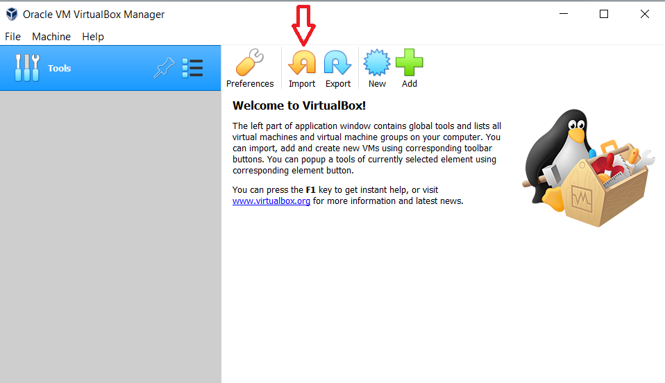
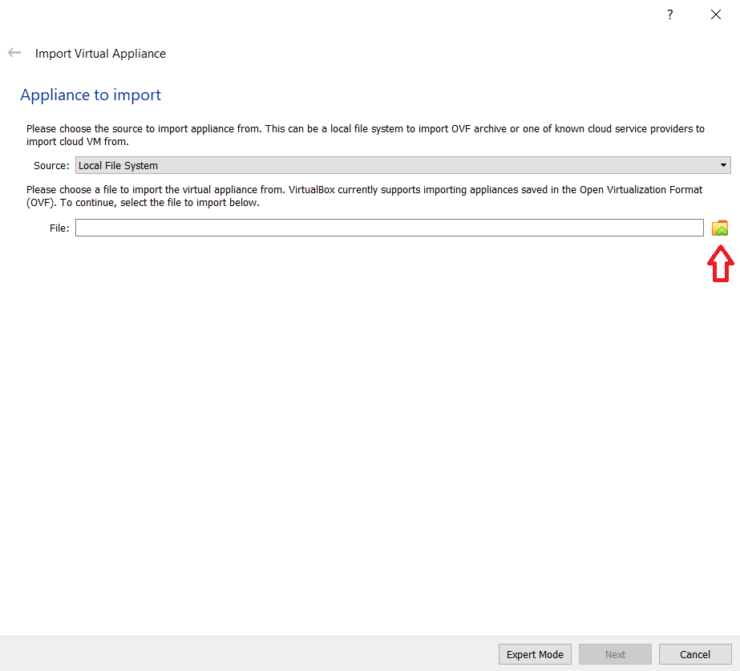
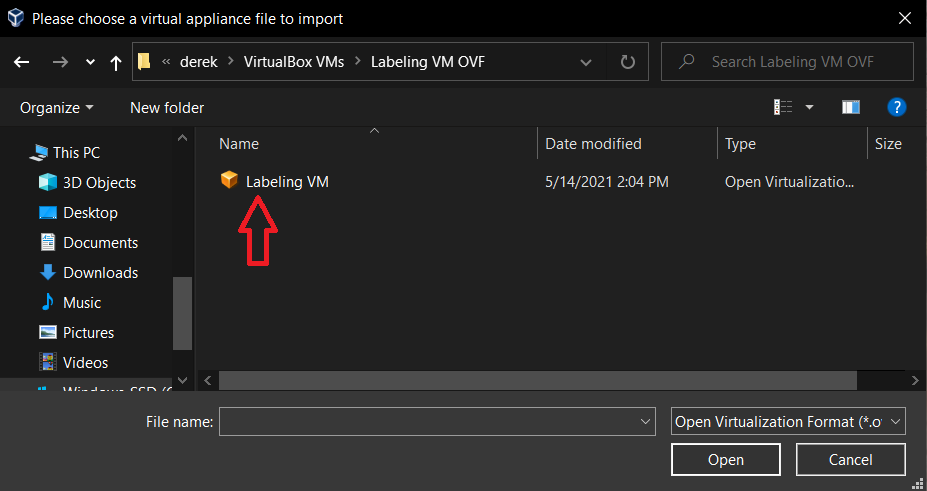
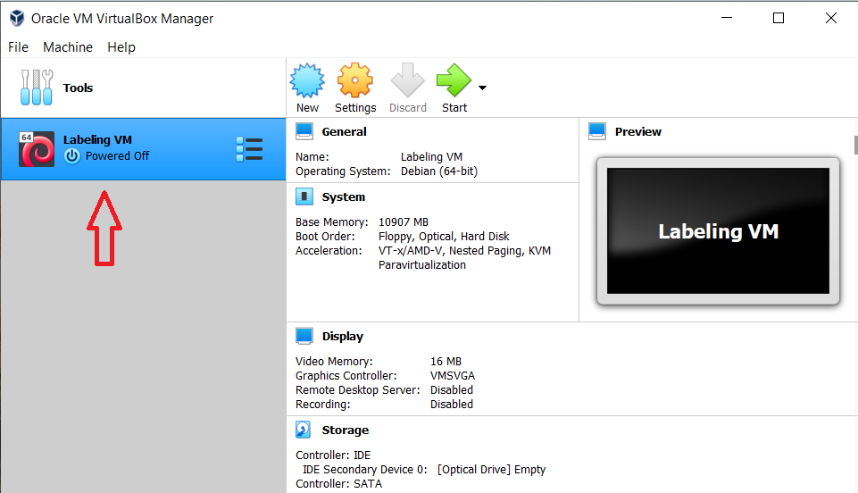
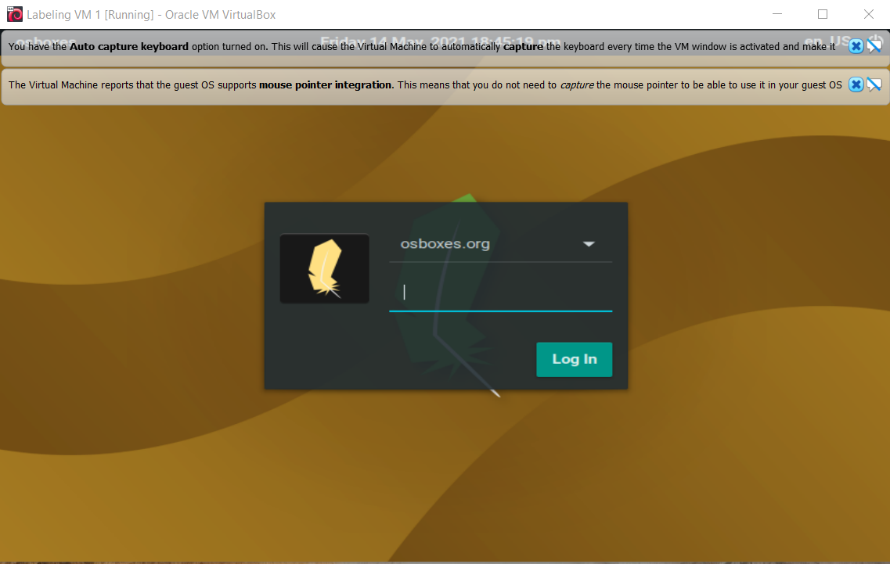
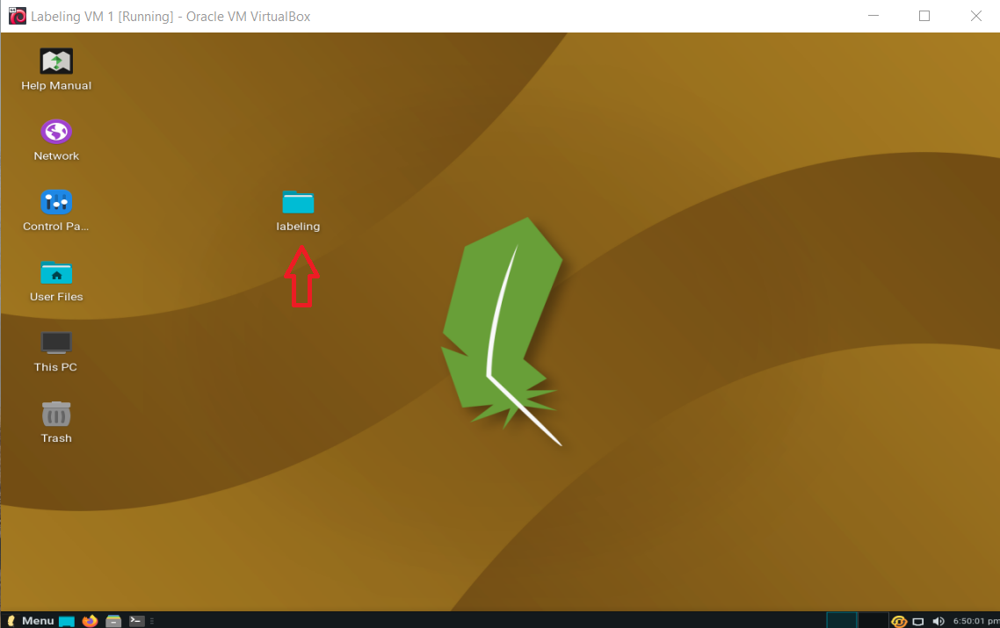
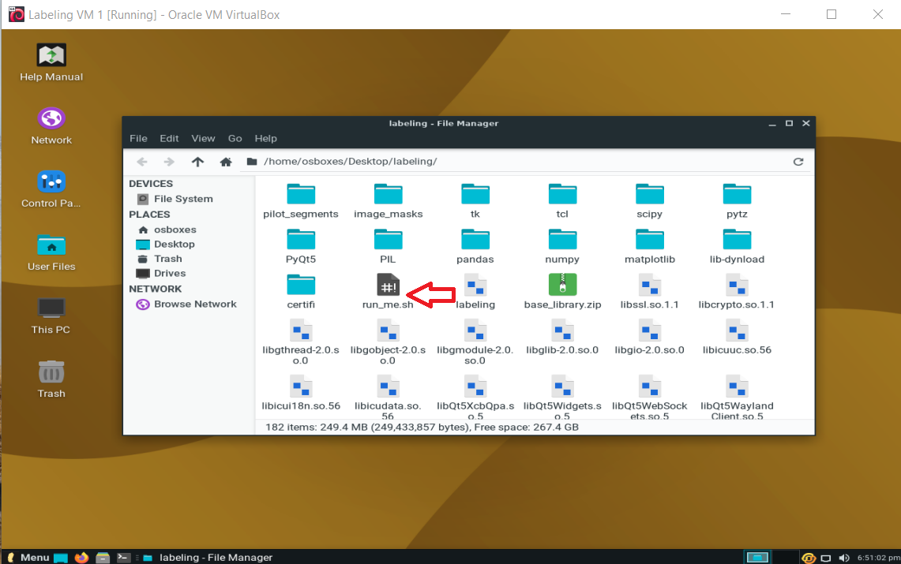
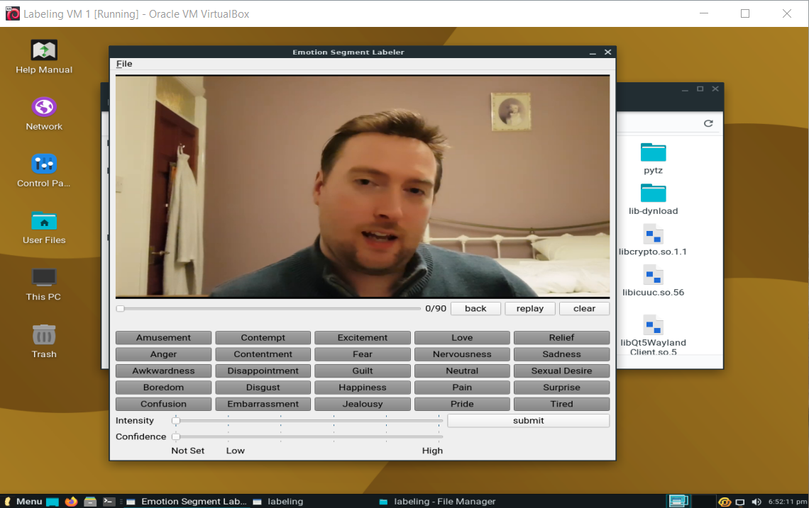

# Instructions for Installing the Labeler

1. Install Virtualbox from [https://www.virtualbox.org/](https://www.virtualbox.org/). 

2. Save the folder `Labeling VM OVF` to your computer.

3. Open Virtualbox. Select the orange `import` icon.

4. In the pop-up, select the folder icon and locate the `.ovf` file from step 2. 
   Then press next.
   

   
5. On the next screen, press import. 

6. On the main VirtualBox screen, a new machine called `Labeling VM` should
appear on the left pane. Double click here to run the virtual machine.
   

* Note: A popup should appear asking to switch to scaled mode. This scales
the VM's screen to the window, which I recommend. However, you can choose no, but
the VM window may appear too big/small.
   
7. A login screen will appear. Do not change the username and enter the 
   password `osboxes.org`. Proceed to login.
   

8. The desktop will load with a folder in the middle called `labeling`. 
Open that folder.
   

9. In that folder there is a file called `run_me.sh`. Double click that file
and the labeler will pop up. You're all ready to label!
   

   
# Instructions for Labeling

When the labeler loads, a short clip will play. There is intentionally no 
sound with this clip. For each clip, there are 4 things you'll need
to do:

1. Select 1 or more emotion keywords that you associate with the
action in the clip. The selected actions will appear in blue, and
you can reclick an action to unselect it.
   
2. Rate the intensity of the action using the slider bar labeled
`Intensity`. The scale is from 1-5, with 1 being the lowest on the
left. For example, someone looking slightly angry may get a 1, and
someone who is bursting with anger may get a 5.
   
3. Rate the confidence you have in the emotion keyword you chose using
the slider bar labeled `Confidence`. The scale is also from 1-5, with
1 (on the left) being the least certain about your label, 5 being
confident that your label is correct.
   
4. Draw on the face of the image to indicate what parts of the
face led to your emotion choice(s). Make sure to draw on the still image
after the clip has finished playing.

Once you've done the 4 above tasks, click submit, and the next
clip will play. Also, after successful submission, the labels and
image masks will save, so you can come back later.

There are a few other options:

* `back`: This option will let you go back to the previous clip. This
removes all of your labels for the previous clip, so you'll have to 
  relabel them.
  
* `replay`: This option replays the current clip.

* `clear`: This option clears the canvas of any drawing on it.

   
# Instructions for Submitting Labels

(todo: add screenshots for this)

1. Once you're finished labeling, there are 2 things we'll need to collect. The 
   labels file called `labels.csv` and the images folder called `image masks`.
   Make sure those are both available. The `labels.csv` file is located in
   the `pilot_segments` folder in `labeling`, while `image masks` should be
   visible in `labeling`.
   
2. Right click on the `image masks` folder and select the option `Compress`.

3. Press create, and a file called `image masks.tar.gz` will be created.

4. Please send the files `labels.csv` and `image masks.tar.gz` as attachments
of an email to `derekdstratton@gmail.com`. You can send this through the
Virtual Machine's browser (it has Firefox available in the bottom left).
   
# Any Other Questions

If you have any other questions or issues, send an email to
`derekdstratton@gmail.com` and I'll try to help.